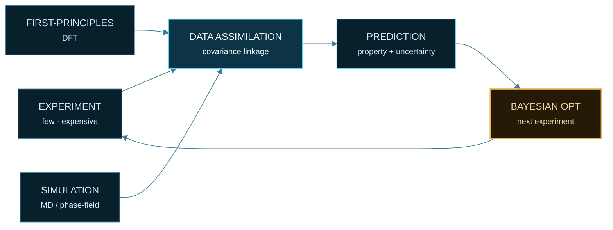
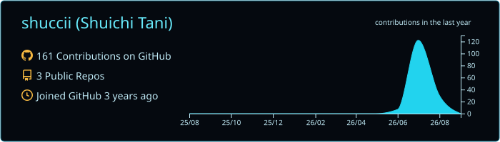
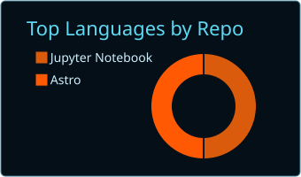
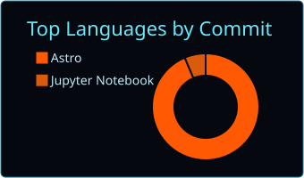
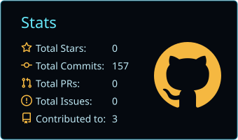
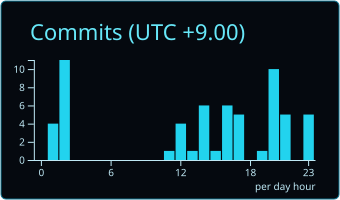

<!-- ─── navigation ─────────────────────────────────────────────── -->

     

## ◤ 01 · RESEARCH

M.S. student at **NAIST**, working on machine-learning property prediction for **fusion reactor structural materials** — reduced-activation ferritic/martensitic steels, tungsten, and other materials that have to survive neutron irradiation at high temperature.

The constraint that shapes everything: irradiation experiments are slow and expensive, so each property has only a handful of measurements. The work is therefore less about bigger models and more about **making scarce experiments talk to abundant computation** — data assimilation, transfer and multi-task learning, multi-fidelity modelling, and uncertainty quantification.

Currently extending into privacy-preserving and federated learning, for materials data that cannot leave the institution that measured it.

## ◤ 02 · METHOD

> Sparse experiments cannot cover a high-dimensional composition space on their own.
> Linked to abundant computation through a shared covariance structure, they can tell you which single experiment to run next.

## ◤ 03 · STACK

     

     

## ◤ 04 · ACTIVITY

 

## ◤ 05 · REPOSITORIES

| | Repository | Contents |
| :---: | :--- | :--- |
| `01` | **[Python-seminar](https://github.com/shuccii/Python-seminar)** | Lab seminar notebooks — regression, SVR, classification, clustering, PCA, and the reasoning behind each. |
| `02` | **[shuccii.github.io](https://github.com/shuccii/shuccii.github.io)** | Personal site — research notes and writing. Astro. |
| `03` | **[shuccii](https://github.com/shuccii/shuccii)** | This profile. The panels above are redrawn from the GitHub API every day by Actions. |

