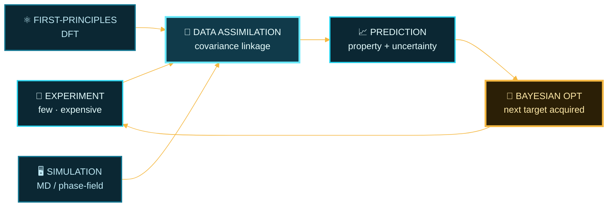

<div align="center">




<p>
  <a href="https://shuccii.github.io"></a>
  <a href="https://github.com/shuccii?tab=repositories"></a>
  
  
</p>


</div>

## ◤ MISSION PROFILE

```console
jarvis@stark:~$ whoami --verbose

  OPERATOR ....... Shuichi Tani  (谷 周一)
  FACILITY ....... NAIST — Nara Institute of Science and Technology
  DIVISION ....... Materials Science × Information Science
  OBJECTIVE ...... ML-driven property prediction for fusion reactor materials
  THREAT ......... data scarcity — neutron irradiation experiments are slow & costly
  COUNTERMEASURE . heterogeneous data assimilation across experiment / DFT / simulation
  STATUS ......... ● ACTIVE
```

- **⚛️ Primary mission** — structural materials that survive a fusion reactor: reduced-activation ferritic/martensitic steels, tungsten, and their behaviour under neutron irradiation and high temperature.
- **🛡️ Core problem** — you cannot brute-force this with data. Irradiation campaigns are expensive, so every property has only a handful of measurements.
- **🔗 My approach** — fuse the scarce experiments with abundant first-principles and simulation data through a shared covariance structure, so the calculations carry the experiments into unexplored composition space.
- **📡 Currently calibrating** — uncertainty quantification, multi-task learning, and privacy-preserving / federated ML for materials data shared across institutions.
- **📍 Base of operations** — Nara, Japan.

<div align="center"></div>

## ◤ TARGETING SYSTEM



> **The loop is the point.** Sparse experiments alone cannot cover a high-dimensional composition space —
> but linked to abundant computation, they can tell you which single experiment to run next.

<div align="center"></div>

## ◤ SUIT SPECIFICATIONS

<div align="center">


<br/>


<br/>


</div>

<div align="center"></div>

## ◤ SYSTEM DIAGNOSTICS

<div align="center">


</div>

<div align="center"></div>

## ◤ PERIMETER SCAN

<div align="center">


<sub>`arc-reactor palette` — the drone sweeps the contribution grid once every 24 hours.</sub>

</div>

<div align="center"></div>

## ◤ ACTIVE PROJECTS

| ID | Designation | Payload |
| :---: | :--- | :--- |
| `01` | **[Python-seminar](https://github.com/shuccii/Python-seminar)** | Lab seminar notebooks — regression, SVR, classification, clustering, PCA, and the reasoning behind each. |
| `02` | **[shuccii.github.io](https://github.com/shuccii/shuccii.github.io)** | Personal uplink. Research notes and writing, built with Astro. |

<div align="center">


<sub>`> J.A.R.V.I.S.: Few experiments, many calculations. The model lives in between.`</sub>

<br/>


</div>
