

<picture><source media="(prefers-color-scheme: dark)" srcset="assets/dark/topbar.svg" /><source media="(prefers-color-scheme: light)" srcset="assets/light/topbar.svg" /></picture>

<picture><source media="(prefers-color-scheme: dark)" srcset="assets/dark/header.svg" /><source media="(prefers-color-scheme: light)" srcset="assets/light/header.svg" /></picture>

<a href="#-01--research"><picture><source media="(prefers-color-scheme: dark)" srcset="https://img.shields.io/badge/01-RESEARCH-5fd8f2?style=flat-square&labelColor=0b2733" /><source media="(prefers-color-scheme: light)" srcset="https://img.shields.io/badge/01-RESEARCH-0e7490?style=flat-square&labelColor=dbe7ee" /></picture></a> <a href="#-02--method"><picture><source media="(prefers-color-scheme: dark)" srcset="https://img.shields.io/badge/02-METHOD-5fd8f2?style=flat-square&labelColor=0b2733" /><source media="(prefers-color-scheme: light)" srcset="https://img.shields.io/badge/02-METHOD-0e7490?style=flat-square&labelColor=dbe7ee" /></picture></a> <a href="#-03--stack"><picture><source media="(prefers-color-scheme: dark)" srcset="https://img.shields.io/badge/03-STACK-5fd8f2?style=flat-square&labelColor=0b2733" /><source media="(prefers-color-scheme: light)" srcset="https://img.shields.io/badge/03-STACK-0e7490?style=flat-square&labelColor=dbe7ee" /></picture></a> <a href="#-04--activity"><picture><source media="(prefers-color-scheme: dark)" srcset="https://img.shields.io/badge/04-ACTIVITY-5fd8f2?style=flat-square&labelColor=0b2733" /><source media="(prefers-color-scheme: light)" srcset="https://img.shields.io/badge/04-ACTIVITY-0e7490?style=flat-square&labelColor=dbe7ee" /></picture></a> <a href="#-05--repositories"><picture><source media="(prefers-color-scheme: dark)" srcset="https://img.shields.io/badge/05-REPOSITORIES-e8b455?style=flat-square&labelColor=0b2733" /><source media="(prefers-color-scheme: light)" srcset="https://img.shields.io/badge/05-REPOSITORIES-9a6a10?style=flat-square&labelColor=dbe7ee" /></picture></a> <a href="https://shuccii.github.io"><picture><source media="(prefers-color-scheme: dark)" srcset="https://img.shields.io/badge/↗-shuccii.github.io-e8b455?style=flat-square&labelColor=0b2733" /><source media="(prefers-color-scheme: light)" srcset="https://img.shields.io/badge/↗-shuccii.github.io-9a6a10?style=flat-square&labelColor=dbe7ee" /></picture></a>

<picture><source media="(prefers-color-scheme: dark)" srcset="assets/dark/system.svg" /><source media="(prefers-color-scheme: light)" srcset="assets/light/system.svg" /></picture> <picture><source media="(prefers-color-scheme: dark)" srcset="assets/dark/radar.svg" /><source media="(prefers-color-scheme: light)" srcset="assets/light/radar.svg" /></picture> <picture><source media="(prefers-color-scheme: dark)" srcset="assets/dark/globe.svg" /><source media="(prefers-color-scheme: light)" srcset="assets/light/globe.svg" /></picture>

<picture><source media="(prefers-color-scheme: dark)" srcset="assets/dark/pulse.svg" /><source media="(prefers-color-scheme: light)" srcset="assets/light/pulse.svg" /></picture> <picture><source media="(prefers-color-scheme: dark)" srcset="assets/dark/languages.svg" /><source media="(prefers-color-scheme: light)" srcset="assets/light/languages.svg" /></picture>

<picture><source media="(prefers-color-scheme: dark)" srcset="assets/dark/log.svg" /><source media="(prefers-color-scheme: light)" srcset="assets/light/log.svg" /></picture>

<picture><source media="(prefers-color-scheme: dark)" srcset="assets/dark/command-strip.svg" /><source media="(prefers-color-scheme: light)" srcset="assets/light/command-strip.svg" /></picture>

## ◤ 01 · RESEARCH

M.S. student at **NAIST**, working on machine-learning property prediction for **fusion reactor structural materials** — reduced-activation ferritic/martensitic steels, tungsten, and other materials that have to survive neutron irradiation at high temperature.

The constraint that shapes everything: irradiation experiments are slow and expensive, so each property has only a handful of measurements. The work is therefore less about bigger models and more about **making scarce experiments talk to abundant computation** — data assimilation, transfer and multi-task learning, multi-fidelity modelling, and uncertainty quantification.

Currently extending into privacy-preserving and federated learning, for materials data that cannot leave the institution that measured it.

<picture>
  <source media="(prefers-color-scheme: dark)" srcset="assets/dark/divider.svg" />
  <source media="(prefers-color-scheme: light)" srcset="assets/light/divider.svg" />
  
</picture>

## ◤ 02 · METHOD

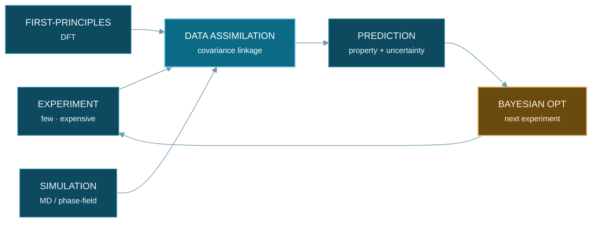

> Sparse experiments cannot cover a high-dimensional composition space on their own.
> Linked to abundant computation through a shared covariance structure, they can tell you which single experiment to run next.

<picture>
  <source media="(prefers-color-scheme: dark)" srcset="assets/dark/divider.svg" />
  <source media="(prefers-color-scheme: light)" srcset="assets/light/divider.svg" />
  
</picture>

## ◤ 03 · STACK

<picture><source media="(prefers-color-scheme: dark)" srcset="https://img.shields.io/badge/Python-040f18?style=flat-square&logo=python&logoColor=5fd8f2&labelColor=040f18" /><source media="(prefers-color-scheme: light)" srcset="https://img.shields.io/badge/Python-eef4f8?style=flat-square&logo=python&logoColor=0e7490&labelColor=eef4f8" /></picture> <picture><source media="(prefers-color-scheme: dark)" srcset="https://img.shields.io/badge/PyTorch-040f18?style=flat-square&logo=pytorch&logoColor=5fd8f2&labelColor=040f18" /><source media="(prefers-color-scheme: light)" srcset="https://img.shields.io/badge/PyTorch-eef4f8?style=flat-square&logo=pytorch&logoColor=0e7490&labelColor=eef4f8" /></picture> <picture><source media="(prefers-color-scheme: dark)" srcset="https://img.shields.io/badge/scikit--learn-040f18?style=flat-square&logo=scikitlearn&logoColor=5fd8f2&labelColor=040f18" /><source media="(prefers-color-scheme: light)" srcset="https://img.shields.io/badge/scikit--learn-eef4f8?style=flat-square&logo=scikitlearn&logoColor=0e7490&labelColor=eef4f8" /></picture> <picture><source media="(prefers-color-scheme: dark)" srcset="https://img.shields.io/badge/NumPy-040f18?style=flat-square&logo=numpy&logoColor=5fd8f2&labelColor=040f18" /><source media="(prefers-color-scheme: light)" srcset="https://img.shields.io/badge/NumPy-eef4f8?style=flat-square&logo=numpy&logoColor=0e7490&labelColor=eef4f8" /></picture> <picture><source media="(prefers-color-scheme: dark)" srcset="https://img.shields.io/badge/pandas-040f18?style=flat-square&logo=pandas&logoColor=5fd8f2&labelColor=040f18" /><source media="(prefers-color-scheme: light)" srcset="https://img.shields.io/badge/pandas-eef4f8?style=flat-square&logo=pandas&logoColor=0e7490&labelColor=eef4f8" /></picture> <picture><source media="(prefers-color-scheme: dark)" srcset="https://img.shields.io/badge/SciPy-040f18?style=flat-square&logo=scipy&logoColor=5fd8f2&labelColor=040f18" /><source media="(prefers-color-scheme: light)" srcset="https://img.shields.io/badge/SciPy-eef4f8?style=flat-square&logo=scipy&logoColor=0e7490&labelColor=eef4f8" /></picture>

<picture><source media="(prefers-color-scheme: dark)" srcset="https://img.shields.io/badge/Jupyter-040f18?style=flat-square&logo=jupyter&logoColor=5fd8f2&labelColor=040f18" /><source media="(prefers-color-scheme: light)" srcset="https://img.shields.io/badge/Jupyter-eef4f8?style=flat-square&logo=jupyter&logoColor=0e7490&labelColor=eef4f8" /></picture> <picture><source media="(prefers-color-scheme: dark)" srcset="https://img.shields.io/badge/Matplotlib-040f18?style=flat-square&logo=plotly&logoColor=5fd8f2&labelColor=040f18" /><source media="(prefers-color-scheme: light)" srcset="https://img.shields.io/badge/Matplotlib-eef4f8?style=flat-square&logo=plotly&logoColor=0e7490&labelColor=eef4f8" /></picture> <picture><source media="(prefers-color-scheme: dark)" srcset="https://img.shields.io/badge/LaTeX-040f18?style=flat-square&logo=latex&logoColor=5fd8f2&labelColor=040f18" /><source media="(prefers-color-scheme: light)" srcset="https://img.shields.io/badge/LaTeX-eef4f8?style=flat-square&logo=latex&logoColor=0e7490&labelColor=eef4f8" /></picture> <picture><source media="(prefers-color-scheme: dark)" srcset="https://img.shields.io/badge/Astro-040f18?style=flat-square&logo=astro&logoColor=5fd8f2&labelColor=040f18" /><source media="(prefers-color-scheme: light)" srcset="https://img.shields.io/badge/Astro-eef4f8?style=flat-square&logo=astro&logoColor=0e7490&labelColor=eef4f8" /></picture> <picture><source media="(prefers-color-scheme: dark)" srcset="https://img.shields.io/badge/Git-040f18?style=flat-square&logo=git&logoColor=5fd8f2&labelColor=040f18" /><source media="(prefers-color-scheme: light)" srcset="https://img.shields.io/badge/Git-eef4f8?style=flat-square&logo=git&logoColor=0e7490&labelColor=eef4f8" /></picture> <picture><source media="(prefers-color-scheme: dark)" srcset="https://img.shields.io/badge/Linux-040f18?style=flat-square&logo=linux&logoColor=5fd8f2&labelColor=040f18" /><source media="(prefers-color-scheme: light)" srcset="https://img.shields.io/badge/Linux-eef4f8?style=flat-square&logo=linux&logoColor=0e7490&labelColor=eef4f8" /></picture>

<picture>
  <source media="(prefers-color-scheme: dark)" srcset="assets/dark/divider.svg" />
  <source media="(prefers-color-scheme: light)" srcset="assets/light/divider.svg" />
  
</picture>

## ◤ 04 · ACTIVITY

<picture><source media="(prefers-color-scheme: dark)" srcset="assets/dark/summary.svg" /><source media="(prefers-color-scheme: light)" srcset="assets/light/summary.svg" /></picture>

<picture><source media="(prefers-color-scheme: dark)" srcset="assets/dark/ledger.svg" /><source media="(prefers-color-scheme: light)" srcset="assets/light/ledger.svg" /></picture> <picture><source media="(prefers-color-scheme: dark)" srcset="assets/dark/hours.svg" /><source media="(prefers-color-scheme: light)" srcset="assets/light/hours.svg" /></picture>

<picture><source media="(prefers-color-scheme: dark)" srcset="assets/dark/grid.svg" /><source media="(prefers-color-scheme: light)" srcset="assets/light/grid.svg" /></picture>

<picture><source media="(prefers-color-scheme: dark)" srcset="assets/dark/divider.svg" /><source media="(prefers-color-scheme: light)" srcset="assets/light/divider.svg" /></picture>

## ◤ 05 · REPOSITORIES

| | Repository | Contents |
| :---: | :--- | :--- |
| `01` | **[Python-seminar](https://github.com/shuccii/Python-seminar)** | Lab seminar notebooks — regression, SVR, classification, clustering, PCA, and the reasoning behind each. |
| `02` | **[shuccii.github.io](https://github.com/shuccii/shuccii.github.io)** | Personal site — research notes and writing. Astro. |
| `03` | **[shuccii](https://github.com/shuccii/shuccii)** | This profile. The panels above are redrawn from the GitHub API every day by Actions. |

<picture>
  <source media="(prefers-color-scheme: dark)" srcset="assets/dark/footer.svg" />
  <source media="(prefers-color-scheme: light)" srcset="assets/light/footer.svg" />
  
</picture>

